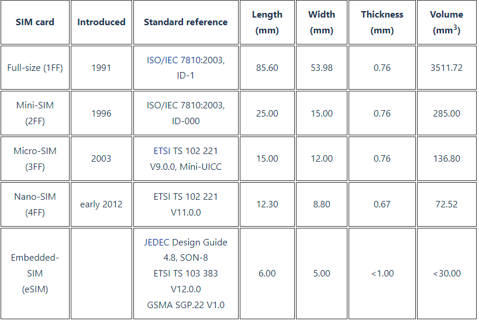

# Types of SIM Cards

Learn about the different types of SIM cards, including full-size, mini, micro, nano, and eSIM.&#x20;

Discover which size is compatible with your device and understand the benefits of each.

<figure><figcaption></figcaption></figure>

#### Based on Size (Form Factor)

* **Full-Size SIM (1FF):** The largest and oldest type, now rarely used.
* **Mini SIM (2FF):** Used in older smartphones and some IoT devices.
* **Micro SIM (3FF):** Still used in some devices, but less common.
* **Nano SIM (4FF):** The most common size used in modern smartphones.
* **Embedded SIM (eSIM):** A digital SIM built into the device, eliminating the need for a physical card.

#### Based on Functionality

* **Single SIM:** Can only hold one mobile subscription at a time.
* **Dual SIM:** Can hold two mobile subscriptions simultaneously.
* **Triple SIM:** Can hold three mobile subscriptions simultaneously.

#### Based on Technology

* **GSM SIM:** Used in GSM networks, which are widely used globally.
* **CDMA SIM:** Used in CDMA networks, which were more common in the US and some Asian countries.
* **LTE SIM:** Supports LTE (4G) networks, the standard for high-speed mobile data.
* **5G SIM:** Supports 5G networks, offering even faster speeds and lower latency.
